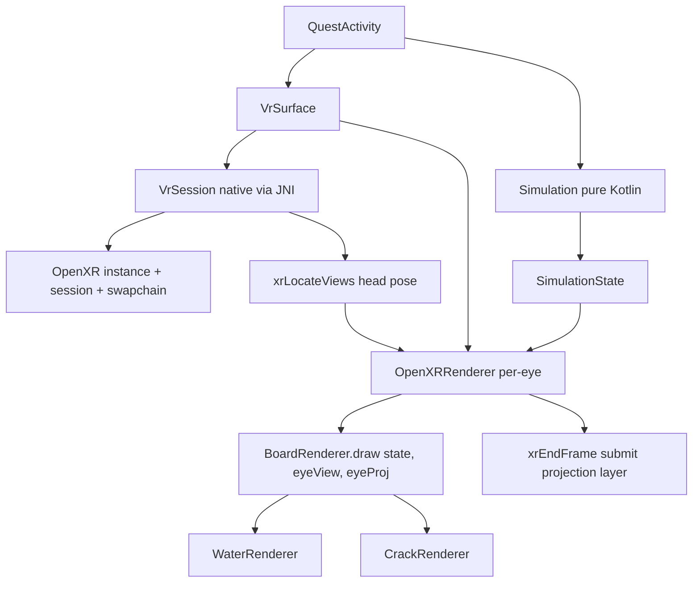

# OpenXR Immersive VR Rendering Plan

## Context

The first milestone is functionally complete as a 2D panel app on Quest 3.
The only remaining code path to "game completion" is OpenXR immersive VR
rendering (the backlog item: "Add OpenXR/Meta XR SDK immersive VR rendering").

The current renderer is monoscopic and `GLSurfaceView`-based. Despite the
class name, `OpenXRRenderer` contains no OpenXR calls. This plan breaks the
OpenXR integration into the smallest safe, testable, reversible Ralph loops.

## Current Architecture (Baseline)

```
QuestActivity
  -> QuestRenderView (FrameLayout)
       -> GLSurfaceView (EGL managed by Android)
            -> OpenXRRenderer (GLSurfaceView.Renderer)
                 -> BoardRenderer.draw(state, viewportW, viewportH)
                      computes own view + projection (fixed camera)
                      -> WaterRenderer / CrackRenderer (receive matrices)
       -> debugView (Android TextView, 250ms poll)
       -> gameOverView (Android TextView)
       -> shellView (title/status)
  -> Simulation (pure Kotlin, command-driven)
```

Key constraints:
- `BoardRenderer.draw()` computes its own view/projection internally.
- `GLSurfaceView` owns EGL — OpenXR needs direct EGL context management.
- Debug overlay + game over are Android TextViews — invisible in immersive VR.
- No NDK, no CMake, no native libraries in the build.
- File size guard: 220 lines (main), 260 (test). Both BoardRenderer and
  QuestRenderView are ~213 lines, so new code must go in new files.
- `com.oculus.intent.category.VR` is omitted from the manifest until an
  OpenXR session exists (removing it causes infinite loading dots).

## Target Architecture

```
QuestActivity
  -> VrSurface (owns EGL context + OpenXR session, replaces GLSurfaceView)
       -> VrSession (native via JNI: instance, session, swapchain, pose)
       -> OpenXRRenderer (per-eye render: acquires swapchain image, draws, releases)
            -> BoardRenderer.draw(state, eyeView, eyeProjection)  [pose-driven]
                 -> WaterRenderer / CrackRenderer (unchanged)
       -> VrOverlay (in-world debug text, replaces Android TextView) [later loop]
  -> Simulation (pure Kotlin, unchanged)
```

## Decision: OpenXR Loader Source

**Recommendation: Khronos OpenXR loader AAR from Maven Central**
(`org.khronos:openxr_loader_for_android`).

Rationale:
- Avoids Meta SDK download, licensing, and local-path complexity.
- The Quest runtime implements the OpenXR runtime; the loader just finds it.
- Maven Central dependency is reproducible under Nix without vendoring binaries.
- Keeps the OpenXR/OpenGL boundary explicit (no Meta API shortcuts in sim).

Fallback if Maven AAR is unavailable or broken under Nix: vendor Meta's
prebuilt `libopenxr_loader.so` for Quest 3. This is a build-config decision
that can be revisited at Loop 26 without affecting earlier loops.

## Decision: Debug Overlay In VR

The Android `TextView` overlay is invisible in immersive VR mode. This is
deferred to a later loop (Loop 31). During VR development, debug info is
available via `adb logcat`. The in-VR overlay will be a simple GL text
renderer or an OpenXR quad layer — decided when we get there.

## Sequenced Loops

Each loop is one Ralph loop: implement, build, test, update docs, commit, stop.

### Loop 24: Make BoardRenderer pose-driven (pure Kotlin, no NDK)

**Goal:** Extract view/projection matrices as parameters to
`BoardRenderer.draw()` so VR can supply per-eye transforms later.

**Why first:** Pure Kotlin, zero device risk, testable with existing unit
tests, sets up the seam that all subsequent VR loops depend on. The 2D panel
mode continues to work unchanged — `OpenXRRenderer` passes the same fixed
camera matrices it computes today.

**Changes:**
- `BoardRenderer.draw(state, viewportW, viewportH)` ->
  `BoardRenderer.draw(state, viewMatrix, projectionMatrix, viewportW, viewportH)`
- `OpenXRRenderer.onDrawFrame()` computes the fixed camera matrices and
  passes them in (same values as today).
- Existing `MeshFactoryTest` / renderer tests unchanged.

**Risk:** Low. Behaviour-preserving refactor. No new files needed.

**Test:** `scripts/pressure_check.sh` passes. 69 tests, 0 failures.

---

### Loop 25: Add NDK + CMake scaffolding (build infrastructure)

**Goal:** Get a trivial native library building and loading from Kotlin.

**Why:** OpenXR is a native C API. The loader is a `.so`. We need NDK +
CMake in the build before any OpenXR code. This is the highest-risk
infrastructure loop and must be isolated from gameplay/rendering changes.

**Changes:**
- `app/build.gradle.kts`: add `externalNativeBuild { cmake { ... } }`,
  `ndkVersion`, `defaultConfig.ndk.abiFilters`.
- `flake.nix`: add NDK to the Android SDK composition.
- `app/src/main/cpp/CMakeLists.txt`: minimal CMake config.
- `app/src/main/cpp/native-lib.cpp`: trivial function (e.g. returns a
  version string).
- `app/src/main/java/.../renderer/NativeBridge.kt`: `System.loadLibrary`
  + external function declaration.
- Call `NativeBridge.version()` from `QuestActivity.onCreate` (logcat only).

**Risk:** High. Nix NDK packaging and Gradle CMake integration can be
finicky. If Nix NDK fails, fall back to the build container
(`containers/android-build.Dockerfile`) or document the blocker in
`FAILURES.md` and proceed with the container.

**Test:** `assembleDebug` succeeds. Native lib loads (logcat on device or
emulator). Unit tests unaffected (no simulation change).

---

### Loop 26: Add OpenXR loader dependency

**Goal:** Link the OpenXR loader into the native build and verify it
initialises on Quest.

**Changes:**
- `app/build.gradle.kts`: add `org.khronos:openxr_loader_for_android` AAR
  (or vendor prebuilt `.so` if Maven unavailable).
- `app/src/main/cpp/CMakeLists.txt`: link `openxr_loader`.
- `app/src/main/cpp/native-lib.cpp`: call `xrEnumerateApiLayerProperties`
  or `xrCreateInstance` with a minimal instance, log result.
- `NativeBridge.kt`: expose `openXrAvailable(): Boolean`.

**Risk:** Medium. Dependency resolution under Nix/Gradle. If the Maven AAR
is not in the Nix cache, may need network access or vendoring.

**Test:** `assembleDebug` succeeds. On Quest, logcat shows OpenXR instance
creation succeeded. No immersive mode yet (manifest unchanged).

---

### Loop 27: OpenXR instance + system detection

**Goal:** Create a proper OpenXR instance, get the system ID for the HMD.

**Changes:**
- New file: `app/src/main/cpp/openxr_session.cpp` (or extend native-lib).
- Create `XrInstance` with view config + graphics binding extensions.
- `xrGetSystem` for `XR_FORM_FACTOR_HEAD_MOUNTED_DISPLAY`.
- Log system ID and view configuration type.
- `NativeBridge.kt`: expose `createInstance()`, `hasSystem()`.

**Risk:** Low-medium. No rendering yet, no EGL changes. Pure OpenXR
boilerplate. Can be verified via logcat.

**Test:** `assembleDebug` succeeds. Logcat on Quest shows system found.

---

### Loop 28: OpenXR session + EGL graphics binding

**Goal:** Create an OpenXR session bound to an OpenGL ES context.

**This is the critical loop where `GLSurfaceView` is replaced.**

**Changes:**
- New file: `app/src/main/java/.../renderer/VrSurface.kt` — owns a direct
  EGL context (not `GLSurfaceView`), creates the OpenXR session with
  `XrGraphicsBindingOpenGLESAndroidKHR`.
- `QuestActivity` hosts `VrSurface` instead of `QuestRenderView`'s
  `GLSurfaceView` (or `QuestRenderView` is refactored to use `VrSurface`).
- Session lifecycle: `xrBeginSession`, `xrEndSession` on activity pause/resume.
- No rendering yet — just prove the session reaches `XR_SESSION_STATE_READY`.

**Risk:** High. EGL context management is the most fragile part. Must
preserve the simulation/rendering boundary. The 2D panel path may need to
remain as a fallback if the session fails.

**Test:** `assembleDebug` succeeds. Logcat shows session ready. App does
not crash on resume/pause.

---

### Loop 29: Swapchain + per-eye render loop

**Goal:** Render the dam stereoscopically to OpenXR swapchain images.

**Changes:**
- `VrSurface` / native: create swapchain, acquire/wait/release images.
- `OpenXRRenderer` refactored to render per-eye: for each eye, get
  `XrView` (pose + projection), call `BoardRenderer.draw(state, eyeView,
  eyeProjection, ...)`, then submit `xrEndFrame` with a projection layer.
- `BoardRenderer.draw()` now receives per-eye matrices (from Loop 24).
- Head pose drives the view matrices via `xrLocateViews`.

**Risk:** High. This is where comfort matters — incorrect pose, wrong eye
order, or frame timing issues cause nausea. Must run at 72/90fps.

**Test:** Device only. Dam visible in stereoscopic VR. No nausea-inducing
jitter. FPS counter still works (may need to move to in-world rendering).

---

### Loop 30: Re-enable immersive VR mode

**Goal:** App launches in immersive VR mode (full headset takeover).

**Changes:**
- `AndroidManifest.xml`: add `com.oculus.intent.category.VR` back to the
  launcher intent filter.
- Verify the OpenXR session is created early enough that the OS loading
  screen resolves.

**Risk:** Medium. If the session is not ready fast enough, the loading
dots return. Must verify the session creation path is synchronous enough.

**Test:** Device only. App launches from Quest library into immersive VR.
No infinite loading. Dam visible in headset.

---

### Loop 31: In-VR debug overlay (deferred)

**Goal:** Show debug statistics inside VR (replaces invisible Android TextView).

**Options (decide when we get here):**
- Simple GL text renderer drawing monospace glyphs in-world.
- OpenXR quad layer for UI.
- Keep 2D panel as a separate debug build flavor.

**Risk:** Low-medium. Does not affect gameplay or comfort if done as an
in-world panel at a fixed distance.

---

### Loop 32: OpenXR controller input (deferred)

**Goal:** Use OpenXR action system for controller input instead of Android
MotionEvent/KeyEvent.

**Why deferred:** Android input events may still work in immersive mode on
Quest. If they do, this is polish. If they don't, it becomes necessary
after Loop 30.

**Risk:** Low. Input translation is already isolated in `InputController`.
The OpenXR action path would be a parallel input source feeding the same
`SimulationCommand` values.

---

## Architecture Diagram



## Guardrails Preserved

- Simulation stays pure Kotlin (agent_check.sh enforces no Android/Meta/
  Oculus/OpenXR imports in simulation package).
- Provider isolation: no providers in this game, but the sim/render boundary
  is preserved — OpenXR code lives in renderer package, reads immutable
  SimulationState, emits SimulationCommand.
- Comfort: no abrupt heading jumps (head pose is read-only from OpenXR),
  no locomotion (player is stationary), fixed board at 2.5m.
- File size guard: new OpenXR code goes in new files (VrSurface, VrSession,
  NativeBridge), not bolted onto BoardRenderer or QuestRenderView.
- Each loop is reversible: if a loop fails, revert the commit and the
  previous loop's state is still green.

## What Is Intentionally Not Changed

- The simulation package (no gameplay rule changes).
- The module catalog, water, pressure, support, failure systems.
- The 2D panel rendering path (remains as fallback until Loop 30).
- The debug overlay formatter (`Overlay.kt`) — only its display surface
  changes in VR.
